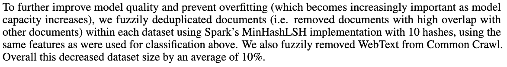

Suppose we have a large collection of documents, and we wish you identify which documents are **approximately** identical to each other. How would we go about that operation? We’re particularly interested in the case where the collection is very large — perhaps a terabyte or more — and so efficiency is paramount.

In this post I want to explore the method of approximate deduplication via Jaccard similarity and the MinHash approximation trick. This is a commonly-used approach to this problem (e.g. the [GPT-3 paper](https://arxiv.org/pdf/2005.14165) describes using it as part of their dataset preparation pipeline), but one I found a bit hard to understand from available resources.

# Jaccard similarity

A natural approach to approximate deduplication is to define some notion of “similarity” between any pair of documents, and group together any two documents whose similarity value is above some threshold. So if we have some universe of possible documents \\(U\\), we might want a similarity measure $$S: U \times U \rightarrow [0,1]$$ and we’ll consider two documents “approximately the same” if \\(S(A,B) \geq S_\textrm{crit}\\).

As a slight aside, it's worth noticing that this definition is not -- in general -- transitive -- we may have three documents \\(A, B, C\\) such that \\(S(A,B)\geq{}S_\textrm{crit}\\) and \\(S(B,C) \geq{} S_\textrm{crit}\\) but \\(S(A,B) < S_\textrm{crit}\\). That means that "approximately identical" is not an [equivalence relation][equivalence], and is part of the reason that approximate deduplication is trickier to scale than finding exact matches.

[equivalence]: https://en.wikipedia.org/wiki/Equivalence_relation

One measure of similarity widely used across several domains, including large-scale text processing is the [Jaccard index](https://en.wikipedia.org/wiki/Jaccard_index), also known as the Jaccard similarity coefficient.

The Jaccard index is a function on **sets**, that characterizes the similarity of two finite sets by comparing the size of their overlap with the size of their union:

$$J(A,B) = \frac{|A\cap{}B|}{|A\cup{}B|}$$

We can render this graphically as so:

> TKTK figure: Jaccard similarity

This calculation should make some intuitive sense; if two sets are similar, they should have **mostly** the same elements (and thus have a relatively large intersection), with relatively few elements unique to each set (and thus the union should not be much larger than the intersection).

It has two very natural limit points, which define its range: For two disjoint sets, the numerator \\(|A\cap{}B|\\) is zero, and the index goes to zero. But if the sets are identical, \\(A\cap{}B = A\cup{}B = A = B\\), and the Jaccard similarity is 1.

If we want to deduplicate document using the Jaccard index, we'll have to tackle two problems, which I'll take in turn: First, we have to turn our documents into sets, so that we can apply Jaccard, and then we'll have to figure out how to make it efficient.

# Representing documents into sets

In order to apply the Jaccard index to textual documents, we need to represent them as sets of some sort. Commonly we'll refer to the elements of such sets, in the abstract, as "feartures," and we'll talk about transforming documents into "feature sets."

There are a number of ways to do this; I'll touch on two fairly common ones.

Before applying either of these approaches, we may wish to apply one or more forms of text normalization. For instance, we likely want to convert to a standard [Unicode normalization form][unicode-norm], and we may also wish to case-fold, collapse runs of whitespace, or perform similar transformations.

[unicode-norm]: https://www.unicode.org/reports/tr15/

## n-grams aka "shingles"

One approach is to just represent each document as a set of all the n-grams that appear in it, for some value of `n`. In the text mining field, these are often referred to as "shingles". We can pick any value of `n`, with the primary tradeoff that smaller values will tend to compare documents more coarsely, and larger ones generating more distinct shingles and thus larger sets that are more expensive to process. According to one source[^fn-n], values of n between 5 and 9 appear to be common, depending on the application.

[^fn-n]: [Mining of Massive Datasets][book] §3.2.2

[book]: http://infolab.stanford.edu/~ullman/mmds/booka.pdf

## Tokenization

We can instead tokenize the input text using some sort of tokenizer, and use the set of unique tokens in each document. This is the approach taken in the GPT-3 paper, which mentions "Spark’s standard tokenizer," which seems to be [this class][spark-token], which simply lowercases the input and then splits on whitespace.

We could also use a hybrid approach, applying a tokenizer that produces numeric token IDs, and then looking at all n-grams of token IDs. In this case we would likely use a smaller value of `n`, since individual tokens should be higher-entropy than bytes or characters.

[spark-token]: https://spark.apache.org/docs/latest/api/python/reference/api/pyspark.ml.feature.Tokenizer.html

# Scaling Jaccard similarity

We now have a **definition** of "approximate similarity": We convert documents into sets of features, and wish to find documents with high Jaccard similarity between their feature sets.

For very small corpora, we could potentially apply that definition directly. However, the definition we've given depends on computing \\(J(D_0, D_1)\\) for **every** pair of documents in our corpus, which entails \\(O(n^2)\\) Jaccard computations. We need to do better than that: if we had a million documents -- still a fairly small number, compared to datasets like "the public web" -- that would be half a **trillion** comparisons.

We can compare this to finding exact duplicates, where we will hash every document, and only compare documents with matching hashes. As long as the rate of hash collision is low enough, we compare each document to \\(O(1)\\) other documents, and only require \\(O(n)\\) work in total.

It turns out, if we're willing to accept a few approximations, we can similarly scale Jaccard similarity! Let's dig in.

## Approximating Jaccard similarity

First, a brief preview of the ground we'll cover:

We'll first consider just the problem of approximating the Jaccard similarity between two documents. We'll find an approximation that avoid examining the entire feature set, and instead only considers a fixed-size (and relatively small) "signature," which suffices to approximate the Jaccard similarity. We'll then scale up to comparing many documents, where we'll exploit the structure of that signature to group candidate documents together, and avoid doing the full all-pairs computation.

### MinHash signatures

Recall that the Jaccard similarity is the ratio of two sizes: the intersection and the union of our two input sets.

$$J(A,B) = \frac{|A\cap{}B|}{|A\cup{}B|}$$

When considering a ratio of areas like this, one classic strategy is to **sample**. If we can select elements from an appropriate distribution, we can query whether those samples are present in the top and bottom halves of the ratio, and use our empirical ratio as an estimate of the true ratio.

How do we sample from \\(A\cup{}B\\)? Here's where the tricks start. We'll take a few observations, and combined them in a way that lets us do nearly all of the work ahead-of-time, as a pre-processing pass over **individual** feature sets.

- First, we'll make the problem apparently more complicated: Let's pick (at random) a mapping assigning each possible feature to some randomly-chosen value. Call this mapping \\(P(x)\\). Now we can sample a random element by selecting the feature in our set that has the smallest random value[^sql]:

$$ x_{\textrm{random}} \leftarrow{} \argmin_{x\in{}A\cup{}B}{P(x)} $$

- Randomly assigning a value to every possible feature is infeasible, but we can approximate it for most purposes using a good hash function (c.f. the "[random oracle][oracle]" model used in cryptographic analysis). If we tolerate the (very small) risk of hash collisions, we can also **only** keep the hash value (and not the relevant feature), which will leave us with a fixed-size value:

$$ x_{\textrm{sig}} \leftarrow{} \min_{x\in{}A\cup{}B}{H(x)} $$

[oracle]: https://en.wikipedia.org/wiki/Random_oracle

- Next, we'll exploit the fact that `min` is associative and so we can rewrite this to pre-process each set individually:


\begin{align*}
a_{\textrm{min}} &= \min_{x\in{}A}H(x) \\
b_{\textrm{min}} &= \min_{x\in{}B}H(x) \\
x_{\textrm{sig}} &= \min(a_\textrm{min},b_\textrm{min})
\end{align*}


[^sql]: If you've ever written `SELECT ... FROM table ORDER by random() LIMIT 1`, you've used a similar trick!

What has all this manipulation achieved? We can pick an appropriate hash function and pre-process **each set** individually, summarizing it with a single hash value. We can then pick any two sets, take the `min` of their signatures, and we have (the hash of) a uniformly-randomly-selected member of their union. In order to estimate the Jaccard similarity, we want to know if that element is present in **both** sets (in their intersection), or just one.

But this construction makes that trivial! We know that \\(x_\textrm{sig}\\) hash the minimum hash function of any element in either set. Therefore, if it is present in, say, set \\(A\\), it must also be the minimum element in set \\(A\\). And we know the minimum elements of each set -- that's precisely what we stored.

Thus, we don't actually need to consider \\(x_\textrm{sig}\\) -- we just need to ask whether \\(a_\textrm{min} = b_\textrm{min}\\). The probability that those elements match is precisely \\(J(A, B)\\)!

Of course, that probability is taken over the universe of possible assignments of features to integers (aka, with some caveats, "over our choice of hash function"); so far, we've only selected a single representative from each set, and our estimate can only take on the values 0 or 1 -- not a lot of precision.

However, we can improve on that by selecting \\(k\\) different hash functions from some appropriate hash family, and summarizing each feature set into a \\(k\\)-element vector:


$$
A_\textrm{sig} =
\begin{pmatrix}
min_{x\in{}A}H_1(x) & min_{x\in{}A}H_2(x) & \cdots{} &  min_{x\in{}A}H_k(x)
\end{pmatrix}
$$


Given two of these signatures, we can approximate the Jaccard similarity by simply comparing each hash:

$$
J(A,B) \approx{} \frac{1}{k}\sum_{i=1}^{k} (A_\textrm{sig}[i] = B_\textrm{sig}[i])
$$

One caveat that I'll mention: the choice of the hash family function here is a bit subtle. We are attempting to approximate a random permutation over the universe of features, but the number of such permutations grows extremely quickly, and so our hash family will represent a tiny fraction of all **possible** permutations. We need to be sure that members of our hash family are not inappropriately correlated -- formally, the salient property here is referred to as ["min-wise independence"][min-wise]. Fortunately, this problem is reasonably well-studied, and we can select solutions from the literature.

[min-wise]: https://en.wikipedia.org/wiki/MinHash#Practical_min-wise_independent_hash_functions

## Comparing all documents

- Just use the signature
- "banding"
  - http://infolab.stanford.edu/~ullman/mmds/booka.pdf p70
  - split the `k` hashes into `b` bands of `r` rows each
  - hash each document `b` times into buckets
  - then compute within each bucket

## Notes
- Discussion of efficiency?
- Jaccard similarity
- Converting documents to sets
    - “shingles” aka n-grams
    - “words”
- Approximating Jaccard similarity
    - Sampling approximation
    - Using a random ordering for efficiency
    - Using several random orderings
- Scaling up to the corpus
    - Just use the min-hash signature
    - Splitting
