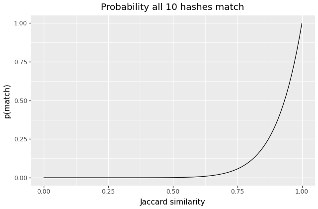
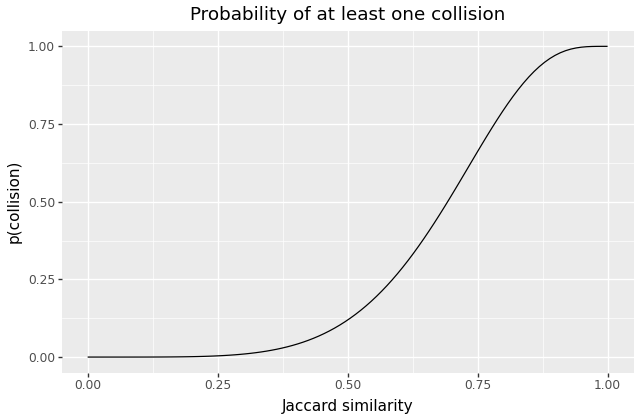

Suppose we have a large collection of documents, and we wish you identify which documents are **approximately** the same as each other. For instance, we may have crawled the web over some period of time, and expect to have fetched the "same page" several times, but to see slight differences in metadata, or that we have several revisions of a page following small edits.

In this post I want to explore the method of approximate deduplication via Jaccard similarity and the MinHash approximation trick. This is a commonly-used approach to this problem (e.g. the [GPT-3 paper](https://arxiv.org/pdf/2005.14165) describes using it as part of their dataset preparation pipeline), but one I had not encountered until recently, and which I find to be pretty interesting.

# Similarity

One approach to approximate deduplication is to define some notion of “similarity” between any **two** documents, and then to search for pairs where their similarity value is above some threshold. So if we have some universe of possible documents \\(U\\), we might define a similarity measure
$$S: U \times U \rightarrow [0,1]$$
and then consider two documents “approximate duplicates” if \\(S(A,B) \geq S_\textrm{crit}\\).

It's worth noticing that this definition is not in general transitive: we may well have three documents \\(A, B, C\\) such that \\(S(A,B)\geq{}S_\textrm{crit}\\) and \\(S(B,C) \geq{} S_\textrm{crit}\\) but \\(S(A,B) < S_\textrm{crit}\\). That means that "approximately identical" is not an [equivalence relation][equivalence], and is part of the reason that approximate deduplication is trickier to reason about, and to perform at scale, compared to finding exact matches.

[equivalence]: https://en.wikipedia.org/wiki/Equivalence_relation

## Jaccard similarity

One measure of similarity widely used across several domains, including large-scale text processing is the [Jaccard index](https://en.wikipedia.org/wiki/Jaccard_index), also known as the Jaccard similarity coefficient.

The Jaccard index is a function that compares **sets**, and characterizes the similarity of two finite sets as the ratio of their overlap to the size of their union:

$$J(A,B) = \frac{|A\cap{}B|}{|A\cup{}B|}$$

I find this calculation makes some intuitive sense: if two sets are similar, they should have **mostly** the same elements. This means the sets are of similar sizes, and their union is only slightly larger, and their intersection only slightly smaller. If the sets are very different, or of very different sizes, then the union will be large and the intersection small.

It has two very natural limit points, which define its range: For two disjoint sets, the numerator \\(|A\cap{}B|\\) is zero, and the index goes to zero. But if the sets are identical, \\(A\cap{}B = A\cup{}B = A = B\\), and the Jaccard similarity is 1.

# Scaling Jaccard similarity

TKTKT edit

We now have a **definition** of "approximate similarity": We convert documents into sets of features, and search for documents whose feature sets have high Jaccard similarity.

For very small corpora, we could potentially apply that definition directly. However, considering every pair of documents scales as \\(O(n^2)\\) with the size of our corpus, which rapidly becomes infeasible.

For **exact duplicates**, we avoid the quadratic cost by hashing, which puts identical documents (and, with good probability, very few other documents) into the same hash bucket. For **approximate** duplicates, we want to find a similar approach; in the jargon of the field, we we want a [locality-sensitive hash][lsh].

[lsh]: https://en.wikipedia.org/wiki/Locality-sensitive_hashing

It turns out such a technique exists for Jaccard similarity! Let's dig in.

## Approximating Jaccard similarity

A brief preview of the ground we'll cover:

We'll first consider the problem of approximating the Jaccard similarity between two documents. We'll find an approximation that avoid examining the entire sets, and which only requires a small, fixed-size "signature," which we can precompute for each document independently. Then, we'll use the structure of that signature to find ways to group documents such that (with good probability) similar documents, and mostly-only similar documents, group together.

### MinHash signatures

Recall that the Jaccard similarity is the ratio of two sizes: the intersection and the union of our two input sets.

$$J(A,B) = \frac{|A\cap{}B|}{|A\cup{}B|}$$

To estimate a ratio of areas like this, one classic strategy is **sampling**. If we can generate random elements appropriately-uniformly, and we can query whether each element is present in the numerator and denominator, we can use our empirical ratio as a test of the true value.

In this case, we know the union is at least as large as the intersection, so we want a uniformly-random sample from \\(A\cup{}B\\). It's not clear how to do that given the sets themselves, but it turns out that if we can do some per-set precomputation, we can make it work!

- First, we make the problem apparently more complicated. We'll assume that features are integers in some finite range \\(0 \leq f_i \leq F\\), and then pick (uniformly at random) a permutation on \\(\mathbb{Z}_F\\). Call that permutation \\(P(x)\\). Now, we can select a random element by selecting the feature in our set that has the smallest value under this permutation[^sql]:

$$ x_{\textrm{random}} \leftarrow{} \argmin_{x\in{}A\cup{}B}{P(x)} $$

- It's not really feasible to work with "uniform random permutations," but we can **approximate** one using a good hash function. This has the merit, as well, of removing the requirement that features be bounded integers; if we hash into an appropriately-large space, collisions will be sufficiently rare that we can essentially ignore the risk, and store only the fixed-size hash value:

$$ x_{\textrm{sig}} \leftarrow{} \min_{x\in{}A\cup{}B}{H(x)} $$

[oracle]: https://en.wikipedia.org/wiki/Random_oracle

- Next, we'll exploit the fact that `min` is associative, and rewrite the above to pre-process each set individually:individually:


\begin{align*}
a_{\textrm{min}} &\leftarrow{} \min_{x\in{}A}H(x) \\
b_{\textrm{min}} &\leftarrow{} \min_{x\in{}B}H(x) \\
x_{\textrm{sig}} &\leftarrow{} \min(a_\textrm{min},b_\textrm{min})
\end{align*}


[^sql]: If you've ever written `SELECT ... FROM table ORDER by random() LIMIT 1`, you've used a similar trick!

Let's step back, and consider what we've achieved. If we pick a good hash function on features, we can compute a "signature" for **each set,** individually, consisting of the minimum hash value of all its features. Given any two sets, then, we can take the minimum of those signatures, and we have (the hash of) some element, drawn uniformly-at-random from their union.

We want to know whether that element is present in the intersection, or whether it's misssing from one side. But this construction also makes that trivial! We know that \\(x_\textrm{sig}\\) is the minimum hash value of any element in either set. Therefore, if it is present in, say, set \\(A\\), it must also be the minimum hash value in that set. But we know the minimum hash values of each set -- that's precisely what we have!

Thus, we don't actually need to compute \\(x_\textrm{sig}\\); we can instead just ask whether \\(a_\textrm{min} = b_\textrm{min}\\)! And it turns out that -- for any two sets -- the probability that the equality holds is precisely \\(J(A, B)\\)!

### Using more hash functions

That probability is taken over the universe of permutations of \\(\mathbb{Z}_F\\) (aka, with some caveats, "over our choice of hash function"). With a single hash function and a single min-hash, we only have a boolean estimate for each pair -- "equal" or "not equal."

We can improve on that by instead selecting \\(k\\) different hash functions from some appropriate hash family, and summarizing each document into a \\(k\\)-element vector:


$$
A_\textrm{sig} =
\begin{pmatrix}
\displaystyle\min_{x\in{}A}H_1(x) &
\displaystyle\min_{x\in{}A}H_2(x) &
\cdots{} &
\displaystyle\min_{x\in{}A}H_k(x)
\end{pmatrix}
$$


Given two of these signatures, we can approximate the Jaccard similarity by counting how many hashes match:

$$
J(A,B) \approx{} \frac{1}{k}\sum_{i=1}^{k} (A_\textrm{sig}[i] = B_\textrm{sig}[i])
$$

One caveat to mention: the choice of the hash family function here is a bit subtle. We are attempting to approximate a random permutation over the universe of features, but the number of such permutations grows extremely quickly, and so our hash family will represent a tiny fraction of all **possible** permutations. We need to be sure that members of our hash family are not inappropriately correlated -- formally, the salient property here is referred to as ["min-wise independence"][min-wise]. Fortunately, this problem is reasonably well-studied, and efficient solutions are available in the literature.

[min-wise]: https://en.wikipedia.org/wiki/MinHash#Practical_min-wise_independent_hash_functions

## Comparing all documents

We've now condensed each document into a \\(k\\)-element fingerprint of hash values, which allows efficient approximation of Jaccard similarities.

The next problem is to find approximate duplicates throughout our entire corpus -- documents with a high similarity -- **without** considering every pair of documents. As alluded to above, our strategy will be to define some set of keys that we can group documents by, and then only perform the full comparison within each group. We will aim to construct the grouping key so that similar documents group together with good probability, and dissimilar ones do not.

### Using the full signature

The simplest choice is to simply to use all \\(k\\) MinHash values together as a grouping key, and consider two documents "approximate duplicates" iff all of their MinHash values match. I'm pretty sure is what the GPT-3 paper cited above means when they say "we fuzzily deduplicated documents [...] using Spark's MinHashLSH implementation with 10 hashes." They split each document into features, computed 10 MinHash values for each document (using 10 different hashes[^MinHashLSH]), and then grouped documents by that 10-vector, and kept only one document per group.

The strongest virtue of this approach is its simplicity and efficiency. Grouping documents by a single high-cardinality bytestring is an efficient operation and easy to scale horizontally, and is offered as a basic primitive in essentially any data-processing toolkit (it's arguably **the** core primitive in [MapReduce][mapreduce], taking the form of the "shuffle" between the map and reduce stages).

How does this approach behave? For a single pair of documents, we expect each MinHash value to be equal with probability \\(J(A,B)\\), so we expect all 10 to match with \\(p=J(A,B)^k\\). For \\(k=10\\), here's what that looks like:

{{}}

As well as some quantiles:

| p(all match) |   1% |  10% |  25% |  50% |  75% |  90% |
|:-------------|-----:|-----:|-----:|-----:|-----:|-----:|
| Jaccard      | 0.63 | 0.79 | 0.87 | 0.93 | 0.97 | 0.99 |
{.quantiles}

We can see that documents with similarities below 0.6 or so will almost-never collide, and that the odds of matches become large around 0.95 or so. If we're primarily concerned about documents that are very close siblings, this approach may be sufficient. And in fact I suspect -- but haven't verified -- that in many corpora, we will encounter fairly bimodal Jaccard values -- two clusters, near 1 and 0. Unrelated documents have similarity close to 0, and similar documents will largely be "nearly-identical" -- e.g. two slight revisions of an article, or two copies of the same context with different timestamps or metadata.

It's also worth noting that the \\(J^{k}\\) calculation holds for a **single** pair of documents. If we have many documents that are all similar, the pairwise probabilities are not at all independent. In practice, given many very-similar documents, they're likely to end up hashed into at-most two or three buckets, and so we will find "almost all" of the duplication, in some sense.

[mapreduce]: https://en.wikipedia.org/wiki/MapReduce

[^MinHashLSH]: If you're curious, Spark [documents its choice of hash family][MinHashLSHModel], along with the relevant literature reference.

[MinHashLSHModel]: https://spark.apache.org/docs/3.1.1/api/python/reference/api/pyspark.ml.feature.MinHashLSHModel.html#pyspark.ml.feature.MinHashLSHModel

### Going fuzzier

(Note: this discussion is primarily sourced from ["Mining of Massive Datasets"][book] section 3.4. I haven't played with this strategy, and don't know whether or when it's used in practice, so far).

What if we want to detect "fuzzier" duplicates? Perhaps after some empirical study, we determine that we want to find pairs with similarities above 0.8 or 0.7, instead of only "near 1."

By using a subset of our \\(k\\) MinHash hashes as a grouping key, we can increase the likelihood of collisions at lower similarity values, and then compare the full signatures within each bucket to weed out false collisions. For instance, we might group by the first 4 MinHash values, and then -- within each colliding group -- use **all** of our MinHash values to estimate the trule similariy.

Using fewer hashes is helpful, but only so far; \\(J^r\\) will always be smaller than \\(J\\), and if we push \\(r\\) too small, the rate of spurious matches will become unacceptable.

What we can do instead is to generate **multiple keys** per document, and place each document into several buckets, one per key, using a different subset of MinHashes for each key. If we compute \\(k=20\\) hashes as our signature, we might place each document into \\(b=4\\) different buckets, using \\(r=5\\) hashes to construct each key, and then compare each pair within each bucket.

What are the odds that two documents end up hashed together in **at least one** bucket?

- The odds that two documents collide using a single key is \\(J^r\\)
- So the odds they **don't** collide based on that key is \\(1-J^r\\)
- So the odds that don't collide in **any** of the buckets is \\(1-J^r)^b\\)

Thus, the odds that they collide at-least-once ends up as:

\\[ p = 1 - (1-J^r)^b \\]

For example, the above example -- using 4 groups of 5 hashes -- produces a probability curve like this:

{{}}

The curve is not as steep as our earlier example, but we've successfully shifted it to the left -- the odds of colliding become 50% at somewhere around \\(J=0.7\\).

It turns out, that for any choice of \\(r\\) and \\(b\\) greater than 1, the resulting curve is S-shaped in a broadly similar fashion, and so varying those values gives us a rich tradeoff space over sensitivity, recall, and performance costs.

# Closing thoughts

Prior to working in AI, I believed myself to be relatively familiar with common algorithmic tricks, including most common [sketch][sketch] algorithms. But I had somehow never encountered MinHash, or even been aware that such algorithms (locality-sensitive hashing) existed or were practical!

I really enjoyed learning how this trick works and digging in. I hope this blog post introduces it to some more engineers for the first time, and/or that it helps fill in the gaps in someone's understanding. I just love neat mathematical/algorithmic tricks!

# Postscript: MinHash and HyperLogLog

While researching and writing this post, I realized that the core MinHash trick reminded me a bit of a classic, somewhat famous, sketch: [HyperLogLog][hll].

The core idea in HyperLogLog (going back to [a much older algorithm][martin-flajolet]) is to hash each element of a stream, and then store a **running maximum** of "the number of leading zeros" in the resulting stream of hashes.

The algorithm is very different in the details, but I think there's a definite conceptual similarity: In both cases, we use a hash function to map an arbitrary input distribution into a uniform distribution (in some appropriate sense), and then we compute a running extremum, which -- with appropriate calculation -- allows us to estimate some distributional property using only a constant-size summary of our input.

And on some search, it turns out that the connection in some sense goes deeper. There's a sense in which HyperLogLog and MinHash are somewhat dual: Given two HyperLogLog structures for two different sets, we can combine them, and estimate the size of their **union**. Given two MinHash structures for those sets, we can compare them and estimate the (relative) size of their **intersection**.

Thus, if you combine both structures, you can produce a sketch that lets you ask questions about both intersections and unions of arbitrary sets! This idea was noticed [at least by 2013][hllminhash], and it turns out there's an [ongoing][hyperminhash] [literature][setsketch] of sketches that combine ideas from the two data structures in interesting ways. I think that's neat!

# Addendum: Representing documents as sets

TKTK EDIT ME

Jaccard similarity operates on sets of some sort; we have documents (likely represented as Unicode strings, or maybe just bytestrings in some contexts). We need to choose a way to turn those into sets. We'll call such sets "feature sets," and we'll refer to the elements as "features."

Before doing further processing, we may want to apply some forms of normalization to our documents. For instance, we likely want to convert to a standard [Unicode normalization form][unicode-norm], and we may also wish to case-fold, collapse runs of whitespace, or perform similar transformations.

After normalization, there are at least two common strategies for converting documents into features:

[unicode-norm]: https://www.unicode.org/reports/tr15/

## n-grams aka "shingles"

We can represent a document as a set of all the n-grams that appear in the document, picking some appropriate value of `n`. In the field of large-scale text processing, often the literature uses the word "shingle" instead of "n-gram," but I find that needless confusing. We can pick any value of `n`, with the primary tradeoff that smaller values will tend to compare documents more coarsely (e.g. most English text probably looks fairly similar through the lens of bigrams), and larger ones generating more distinct features and thus larger sets. At some limit I expect you also lose sensitivity, but I suspect performance problems arise earlier.

According to one book on the matter[^fn-n], values of n between 5 and 9 appear to be common choices for a range of applications.

[^fn-n]: [Mining of Massive Datasets][book] §3.2.2

[book]: http://infolab.stanford.edu/~ullman/mmds/booka.pdf

## Word-splitting

We can instead attempt to split the input into "words" or "tokens," and use those as our features. The except from GPT-3 paper above mentions "Spark’s standard tokenizer," which I believe refers to [this class][spark-token], which simply lowercases the input and then splits on whitespace.

We could use a [more sophisticated tokenizer][nltk], or we could hybridize the approaches by tokenizing and then using n-grams of tokens. In that case we would use a smaller value of `n`, since individual tokens should much be higher-entropy than bytes or characters.

[nltk]: https://www.nltk.org/api/nltk.tokenize.html#module-nltk.tokenize
[spark-token]: https://spark.apache.org/docs/latest/api/python/reference/api/pyspark.ml.feature.Tokenizer.html

[martin-flajolet]: https://en.wikipedia.org/wiki/Flajolet%E2%80%93Martin_algorithm
[sketch]: https://www.cs.cornell.edu/content/sketching-algorithms
[hll]: https://en.wikipedia.org/wiki/HyperLogLog
[setsketch]: https://arxiv.org/abs/2101.00314
[hllminhash]: https://tech.nextroll.com/media/hllminhash.pdf
[hyperminhash]: https://arxiv.org/abs/1710.08436
