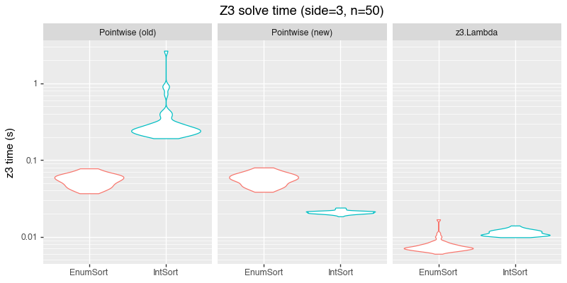

For a while now, I've been fascinated by [Z3][z3] and by [SMT solving][smt] more broadly. While on pat leave recently, I was reminded of the existence of [regular-expression crossword puzzles][regexle], and allowed myself to get nerdsniped by writing a Z3-backed solver.

I expected to spend perhaps an afternoon cranking out a quick solver; I ended up getting sucked into understanding and debugging Z3 performance, and learning far more about Z3 and about SMT than I expected. In this post, I'll describe my approach and my initial solver, and then dive into some of the improvements and variations I explored.

All of my code is [available on github](https://github.com/nelhage/nelhage-sandbox/tree/main/regexle), if you want to follow along or check out my final results.

## Regular expression crosswords

To briefly recap: A regular-expression crossword consists of a grid of (unknown) characters, which are to-be-determined. These characters are constrained by a set of given [regular expressions][regex], which must match a given row or column, once filled in. I chose to solve the [regexle] variant, specifically, which uses a hexagonal grid, but most of my code would readily adapt to other variants.

[regexle]: https://regexle.com/
[regex]: https://en.wikipedia.org/wiki/Regular_expression

## Regexes as DFAs

In order to solve the puzzle with a constraint solver like Z3, we need to find a way to encode the constraint "_this_ sequence of characters matches _this_ regular expression," and then just assert all of the clues, and ask for a grid that satisfies all the constraints.

My immediate first thought was to rely on the fact that a regular expression describes a [regular language][regular-lang][^regular], and thus can be recognized using a deterministic finite automaton. Thus, I can encode a regular expression into a DFA, and then express regex matching in Z3 in terms of its transition function[^z3-re].


[^regular]: I include here the obligatory disclaimer that many modern "regular expression" libraries support non-regular features like backreferences. My strategy won't work for regex crosswords that use those, but I choose to be okay with that.
[^z3-re]: Some readers may be thinking "But wait! Doesn't Z3 natively support regular expressions??" When I started this project I wasn't aware of that feature, but [I tried them out, eventually, too](#using-z3-regular-expressions)!

That is, if we have a three-character string `S = [c0, c1, c2]`, and we have the transition table `T : State × Char → State` for our regex, we can express "the regex matches S" as something like:

```python
state_0 = init_state
state_1 = T(state_0, c0)
state_2 = T(state_1, c1)
state_3 = T(state_2, c2)
assert(state_3 in accept_states)
```

[regular-lang]: https://en.wikipedia.org/wiki/Regular_language

## Turning a regular expression into a DFA

With a bit of searching, I discovered [qntm]'s [greenery library][greenery], which was pleasingly exactly what I was looking for -- a relatively straightforward Python library for manipulating regular expressions, including transforming back and forth between regex syntax and DFAs (which it calls [FSMs][greenery-fsm]). It will build an FSM for us, and in general it is pleasingly straightforward, optimized for simplicity, ease-of-use, and experimentation instead of raw performance, which is just fine for us -- we're going to make Z3 do all the heavy lifting.

[qntm]: https://qntm.org/
[greenery]: https://github.com/qntm/greenery
[greenery-fsm]: https://github.com/qntm/greenery?tab=readme-ov-file#fsm

One complication is that `greenery` handles regular expressions over arbitrary Unicode characters; in order to avoid enormous lookup tables, it represents transitions in terms of character ranges, which I found slightly more annoying to work with. For this project, I'm willing to assume an alphabet of English letters (A-Z), so I wrote a helper to translate `greenery`'s structure into a flat `numpy` transition table:

```python
ALPHABET = string.ascii_uppercase

def flatten_fsm(fsm):
    nstate = len(fsm.states)
    nvocab = len(ALPHABET)

    assert fsm.states == set(range(nstate))
    state_map = np.full((nstate, nvocab), -1, dtype=np.int32)
    for st, map in fsm.map.items():
        for i, c in enumerate(ALPHABET):
            for cc, dst in map.items():
                if cc.accepts(c):
                    state_map[st, i] = dst
                    break
    return state_map
```

I also defined a small dataclass to bundle together various representations and analysis for a single regular expression:

```python
@dataclass
class Regex:
    pattern: str
    parsed: greenery.Pattern

    # 2d: (state, vocab) -> new state
    transition: np.ndarray
    # 1d: state -> bool
    accept: np.ndarray

    @classmethod
    def from_pattern(cls, pattern: str):
        parsed = greenery.parse(pattern)
        fsm = parsed.to_fsm().reduce()

        transition = flatten_fsm(fsm)
        nstate = transition.shape[0]
        accept = np.zeros((nstate,), bool)
        for st in fsm.finals:
            accept[st] = True

        return cls(
            pattern=pattern,
            parsed=parsed,
            transition=transition,
            accept=accept,
        )
```

## Mapping into Z3

In order to put the pieces together, we need to teach Z3 about the transition functions for each clue, define Z3 variables for each character in our grid, and then add appropriate constraints on the characters using the relevant transition functions.

I chose to represent both states and characters as integers (adding assertions to ensure that they were in-range), since that seemed simplest. Then, we need to encode the transition function relationship, between states and characters.

Z3 supports [function types][z3-functions], which can be declared and manipulated in expressions and assertions. Thus, I declared a function of the appropriate type, and informed Z3 of the transition table using an assertion for each entry in the transition table:

[z3-function]: https://microsoft.github.io/z3guide/docs/logic/Uninterpreted-functions-and-constants


```python
def build_func(solv: z3.Solver, clue: Clue):
    ctx = solv.ctx
    state_func = z3.Function(
        clue.name + "_trans",
        z3.IntSort(ctx),
        z3.IntSort(ctx),
        z3.IntSort(ctx),
    )
    pat = clue.pattern

    for (state, char), next_state in pat.all_transitions():
        solv.add(state_func(state, char) == next_state)

    return state_func
```

Given that definition, and given a string (represented as a list of characters), we can easily express the "regex matching" constraint:

```python
def assert_matches(solv: z3.Solver, clue: Clue, chars: list[z3.AstRef]):
    state_func = self.build_func(solv, clue)
    pat = clue.pattern

    # Create constants for each state
    states = z3.IntVector(clue.name + "_state", 1 + nchar, ctx=solv.ctx)

    # Express the transition requirement
    for i, ch in enumerate(chars):
        solv.add(state_func(states[i], ch) == states[i + 1])

    # Each state must be valid
    for st in states:
        solv.add(0 <= st)
        solv.add(st < pat.nstate)
    # State zero is the initial state
    solv.add(states[0] == 0)

    # The final state must be accepting
    solv.add(z3.Or([
        states[-1] == i
        for i, ok in enumerate(pat.accept) if ok
    ])
```

## Putting it together

With those primitives, we now just need to define a grid of characters, and add appropriate assertions. I was still using [regexle][regexle] as a source of test cases; it operates on a hexagonal grid, and mapping coordinates between the hex grid and the three different clue axes was honestly one of the hardest parts of this exercise! Glossing over that bit, though, the code is quite simple:

```python
def make_char(solv: z3.Solver, name: str) -> z3.ExprRef:
    ch = z3.Int(name, solv.ctx)
    solv.add(0 <= ch)
    solv.add(ch < len(ALPHABET))
    return ch

grid = [
    [make_char(solv, f"grid_{x}_{y}") for y in range(maxdim)]
    for x in range(maxdim)
]

for clue in all_clues:
    coords = word_coords(clue.axis, clue.index)
    chars = [grid[x][y] for x, y in coords]

    assert_matches(
        solv,
        clue,
        chars,
    )
```

# Solver performance

At this point -- once I put all the pieces together -- I was able to solve crosswords, but it was ... painfully slow. Some 3x3 puzzles took upwards of **ten minutes** of Z3 time on my M1 Macbook Air! I figured out how to let Z3 use multiple cores, which was a small constant-factor speedup, but this fundamentally seemed way too slow.

I expected -- on vague internal heuristics -- that Z3 should be able to solve these puzzles in milliseconds. Thus, I felt compelled to spend some time debugging and understanding just why my solver was so slow, and how to speed it up.


At the time, I was a total Z3 novice so I didn't really know what to try or what to look at; during the adventures that followed I would learn a **ton** more. I ultimately achieved the speeds I expected, but there were a lot of red herrings and surprises along the way.

Even before this project, I had a vague sense that that SMT solvers have notoriously opaque and [unstable][smt-unstable] performance properties. Nonetheless, I found myself surprised by just how true that turned out to be, even for what I thought was a pretty simple problem. I still do not fully understand a number of the behaviors I encountered.

[smt-unstable]: https://ceur-ws.org/Vol-4008/SMT_paper21.pdf

I'll start by sharing the two changes I made which ultimately had the greatest impact -- producing, as best I can tell, a fast and reliable solver -- but then I'll share some of my false starts and other oddities.

## Pruning states

As I mentioned, I'm not (wasn't?) a Z3 expert, but I do understand regexes quite well. Thus, my first idea was to help Z3 out by doing some domain-specific analysis to generate additional constraints.

As a motivating example, consider the regex `(NR|Q|I)+`, from [today's regexle](https://regexle.com/?side=3&day=458) as I write this. It's immediately obvious that the answer can only contain the letters N, R, Q, and I. However, my code hard-codes an alphabet of `A-Z` for all squares, and requires Z3 to rule out all the other letters. What if we instead detected the actual legal alphabet, and encoded it into our Z3 problem?

As humans we easily detect that property by looking at the regex source. We could write code to do a similar analysis, but in general the problem is not quite as straightforward. I realized, however, that we can instead do a similar analysis on the transition tables we already have. Moreover, because I am now [a scientist][circuits-framework] as well an engineer, I choose to do so in a few scant lines using some `numpy` tricks.

We define a state in our FSM as "dead" if there is no sequence of transitions leading from that state to any accepting state. Because we work on a minimal FSM, courtesy of [a `greenery` analysis pass](https://github.com/qntm/greenery/blob/e55c96712677d56ef14664a1595a47fb7f26bc01/greenery/fsm.py#L166-L172), we know there is at-most one dead state, and all out-edges from that state will be self-loops. We can easily detect the dead state by looking for that condition:

[circuits-framework]: https://transformer-circuits.pub/2021/framework/index.html

```python
# Method on the above class `Regex`
@cached_property
def dead_states(self) -> set[int]:
    looped = self.transition == np.arange(self.nstate)[:, None]
    return set(np.flatnonzero(looped.all(-1) & ~self.accept))
```

(Note that we will only ever have zero or one dead states, but using `set[int]` will let us treat those cases uniformly by iterating over the set, which I found a bit cleaner than using `int | None`)

Given the dead state, we can define a dead **character** as one which always transitions to a dead state, from any initial state:

```python
@cached_property
def dead_vocab(self) -> set[int]:
    dead = set()
    for d in self.dead_states:
        dead |= set(np.flatnonzero((self.transition == d).all(0)))
    return dead
```

We can also ask which characters are dead starting from any given state:

```python
def dead_from(self, state: int) -> set[int]:
    dead = set()
    for d in self.dead_states:
        dead |= set(np.flatnonzero((self.transition == d)[state]))
    return dead
```

Armed with that information, we can give Z3 a few more constraints:

```python
for d in pat.dead_vocab:
    for ch in chars:
        solv.add(ch != d)

for d in pat.dead_from(0):
    solv.add(chars[0] != d)

for d in pat.dead_states:
    for st in states:
        solv.add(st != d)
```

These constraints are, strictly-speaking redundant, but our hope is that our knowledge of the problem structure lets us find these facts more easily than Z3 can, and let Z3 focus faster on the "interesting" part of the search space.

Indeed, I found this pruning exercise an interesting example of how you can use a generic prover/solver like Z3, but nonetheless augment it with domain-specific heuristics to improve performance. My sense is that this hybrid is fairly common in practice; solvers aren't magical and if you can deduce additional structure using domain-specific analysis, it will often give the solver an important boost.

If I wanted, it would be relatively straightforward to additionally ask Z3 to **verify**, on some specific puzzles, that these constraints are redundant, which would be a useful correctness check. For this toy project I didn't bother.

## Defining the transition function explicitly

I described, above, encoding the transition table for each regex as a Z3 function, and then nailing down its behavior using pointwise assertions about each `(state, character)` pair. I eventually discovered that I could get better performance by representing the transition as an explicit expression, instead of an uninterpreted function; I speculate that doing so encouraged Z3 to reason through the relation equationally instead of falling back on search, but I'm honestly unclear.

We'll write a Python function which represents the transition table as an explicit `if-then` ladder analyzing a (state, character) input. We'll start with a helper which effectively does a "match" or "switch" statement on a single variable:

```python
def build_match(
    var: z3.AstRef,
    test: list[z3.AstRef],
    result: list[z3.AstRef],
) -> z3.AstRef:
    """Return a Z3 `if` ladder comparing var against each `test` value.

    If `var == test[i]`, the ladder evaluates to `result[i]`. If no
    `test` matches, evaluate to `result[-1]`; it is anticipated that
    normally the list of tests will be exhaustive.
    """
    expr = result[-1]
    for test_, then_ in zip(test[:-1], result[:-1], strict=True):
        expr = z3.If(var == test_, then_, expr)
    return expr
```

Now, given Z3 expressions corresponding to a state and a character, we can build an explicit expression computing the new state:

```python
def build_next_state(
    self, clue: Clue, st: z3.AstRef, ch: z3.AstRef
) -> z3.AstRef:
    pat = clue.pattern
    by_state = [
        build_match(
            ch,
            self.alphabet,
            [self.states[out] for out in pat.transition[i]],
        )
        for i in range(pat.nstate)
    ]

    return build_match(
        st,
        self.states[: pat.nstate],
        by_state,
    )
```

Now, where previously we had written `state_func(states[i], ch) == states[i + 1]`, we can instead embed the entire expression for each transition:

```python
for i, ch in enumerate(chars):
    solv.add(self.build_next_state(clue, states[i], ch) == states[i + 1])
```

This approach resulted in a substantial speedup, and, in particular, made performance much more **consistent**; at larger puzzle sizes, I saw many fewer "slow puzzles" than with the old pointwise-assertion approach.

Unfortunately, this direct approach had a significant downside: constructing the huge Z3 if-then ladders turned out to be quite expensive, to the point where we spent far longer constructing the Z3 expression than we spent solving it!

### Sharing the expression

Can we get the best of both worlds? It took me a fair bit of digging and experimentation, but I was able to find a way to get the same performance as the explicit expression, but only construct the expression once. In fact, I found two different strategies, illustrating a number of Z3 features.

#### Using a Z3 lambda expression

Instead of using a Z3 function object, we can wrap the big `if` ladder in a `z3.Lambda` expression, which gives us a way to explicitly instantiate it multiple times with different parameters. Given our `build_next_state` function above, it's a very small change to do so:

```python
st = z3.Int("st")
ch = z3.Int("ch")

lambda_ = z3.Lambda([st, ch], self.build_funcexpr(clue, st, ch))

for i, ch in enumerate(chars):
    solv.add(lambda_[states[i], ch] == states[i + 1])
```

#### Using a Z3 function and `macro-finder`

While exploring other options, however, I was reading [the SMT-LIB specification][smt-lib-spec], and noticed that SMT-LIB allows defining functions with explicit bodies:

```lisp
(define-fun double ((x Int)) Int (* x 2))

;; evaluates to `8`
(simplify (double 4))
```

I was unable to find a way to create such a function using Z3's Python API. Reading the spec some more, though, I learned that the above syntax is defined in terms of `declare-fun` and a `forall` assertion:


Z3 gives us access to those tools, so I tried using them:

```python
state_expr = self.build_funcexpr(clue, st, ch)
solv.add(z3.ForAll([st, ch], state_func(st, ch) == state_expr))
```

This approach worked, in the sense of producing correct solutions, but it turned out to be one of the slowest approaches I tried!

After even **more** digging, however, I found a fix! Z3 has a ["tactic" by the name of "macro-finder"][macro-finder]. Z3 tactics are transformations which allow for user-directed simplification or transformation passes outside of the core SMT solver. `macro-finder` implements a number of transformations, but at its most basic, it finds `forall` assertions which "define" the meaning of a function, and effectively copy-pastes them in place of invocations of that function. Essentially, it transforms our `forall` variant into the "explicit expression every time" variant, but by virtue of being implemented in C++ and closer to the Z3 core, it does so quite efficiently.

I found that all three approaches (the explicit expression, a Z3 `lambda`, and a `forall`+`macro-finder`) resulted in similar solve times in Z3, and the `z3.Lambda` and `macro-finder` approaches were both comparably-fast in terms of runtime to define the problem.

[macro-finder]: https://microsoft.github.io/z3guide/docs/strategies/summary#tactic-macro-finder

## False starts

Now, we can dig into all the things that didn't work, or at least weren't necessary. In doing so, we'll learn about even more Z3 features, and some surprising performance behaviors. If you prefer, you can jump to [my closing thoughts](#conclusion).

### Z3 `EnumSort`

Z3 knows a **lot** about the integers, and has [many different solvers][z3-arithmetic] for different classes of integer arithmetic. I wondered: Can we speed up the solver by using some other data type, and just avoid invoking any of that integer logic, at all?

[z3-arithmetic]: https://z3prover.github.io/papers/programmingz3.html#sec-solving-arithmetical-fragments

Thus, I tried replacing my states and characters with [SMT-LIB enumeration types][z3-enumeration] (exposed to Python as [z3.EnumSort][EnumSort]).

[z3-enumeration]: https://microsoft.github.io/z3guide/docs/theories/Datatypes#scalars-enumeration-types
[EnumSort]: https://z3prover.github.io/api/html/namespacez3py.html#a9cf7ec94a9dd102286790774b5359556

We can define an enumeration sort for our states and for our characters, creating a new type with no behavior other than having exactly N distinct values:

```python
nstates = max(c.pattern.nstate for c in all_clues)
state_sort, states = z3.EnumSort(
    "State",
    [f"S{i}" for i in range(nstates)],
)

char_sort, alphabet = z3.EnumSort("Char", list(ALPHABET))
```

The rest of our code also only minimally changes; we need to replace `IntSort` in the declaration of our transition functions, and we need to replace `i` with `states[i]` or `alphabet[i]` any time we are encoding a specific state or character.

#### `EnumSort` performance

When I first switched to `EnumSort`, I saw a **massive** speedup!


{.center}

However, it turned out that I was at-best partially correct about why I saw that speedup. Here's the same plot, but now I've added two new panels: One, which still uses the pointwise function definition but with a small change I'll mention in a minute, and one which uses the `z3.Lambda` encoding I described above:


{.center}

With my current code, `IntSort` is **faster** with the pointwise function definition, and the speedup from explicitly encoding the transition function dwarfs any other change.

#### A bizarre performance instability

What did I change between "(old)" and "(new)"?

When we're using integers to represent states, we bound the integers with additional assertions. Above, I showed the original code I wrote for those bounds:

```python
# Each state must be valid
for st in states:
    solv.add(0 <= st)
    solv.add(st < pat.nstate)
```

When I was refactoring my code to experiment with other representations, I unintentionally changes the behavior to instead bound our states using the **maximum** number of states for any clue, not just the current one:


```python
max_nstate = max(clue.pattern.nstate for clue in all_clues)

for st in states:
    solv.add(0 <= st)
    solv.add(st < max_nstate)
```

At least on my version of Z3, the second approach -- which is a **looser** bound! -- is much, much faster. That change is, I believe, the only meaningful difference between the `IntSort` plots for "(old)" and "(new)"!

In addition, I don't actually understand why `EnumSort` is slower for the pointwise function definition. I've poked at Z3 traces and statistics, and it looks like Z3 is somehow struggling to reason equationally through our `xfer(st, ch) == st_next` assertions in the Enum case, necessitating a bit more search-and-backtracking, but I don't understand why.

## Using Z3 regular expressions

Somewhere amid refactoring to support a whole matrix of representations, and profiling and plotting them, I also tried a **completely** different approach to solving the problem!

Z3, it turns out, also has a [theory of regular expressions][z3-regex]! We can bypass our state-machine machinery entirely, and directly encode the regex clues as Z3 regular expressions.

Z3 does not come with a regular-expression parser, but instead has combinators to build up patterns, such as `z3.Re(char)`, `z3.Range(start, end)`, `z3.Star(re)`, and so on. Thus, I [wrote a simple translation layer][z3_re.py] which recursively walks the `greenery` `Pattern` AST, and translates it into a Z3 regex. From there, we can just declare each unknown character as a Z3 string object, and assert each clue like so:

```python
re = greenery_to_z3(clue.pattern)

string = z3.Concat(chars)
solv.add(z3.InRe(string, re))
```

Arguably much simpler! Is it fast? It's ... decent.


{.center}

On the one hand -- especially for large puzzles -- we can solve puzzles much faster by pulling in all of the tricks I've discussed in this post. On the other, the solver using Z3 regexes is probably by-far the simplest any I considered or implemented, and it's nearly 10x faster than my initial, naive, attempt.

I suspect the pattern generalizes: If Z3 has first-class support for your problem domain, it's worth starting there! However, Z3 shines first-and-foremost in being a very general tool and offering a uniform interface for many, many different problem types; if you're willing to invest effort, to do experiments, and to deploy domain-specific expertise, there's a good chance you solve instances faster, at the cost of adding complexity on your side.

[z3-regex]: https://microsoft.github.io/z3guide/docs/theories/Regular%20Expressions
[z3_re.py]: https://github.com/nelhage/nelhage-sandbox/blob/main/regexle/src/regexle/z3_re.py

# Conclusion

This was a fun project! I originally expected it would be a fun afternoon nerd-snipe, and indeed my original script took maybe an hour or two to whip together. However, I wasn't able to shake the urge to optimize, and to understand Z3 better, and in the time since I've spent a somewhat-unreasonable time refactoring, exploring variations, running benchmarks, making plots, and so on. However, in doing so I now understand both Z3 and SMT-LIB much, much better, which was, after all, my original goal! I'm excited to find more opportunities to deploy them "in anger" in the future.

I'll close with a few reflections/lessons about working with Z3 that I've taken away from this experience.

#### Z3 supports many more features than I'd realized.

I've mostly encountered Z3 (in passing) as a solver for problems involving integers, bit-vectors, and sometimes arrays. I learned about many new datatypes and theories which it supports, including:

- Strings, sequences, and regular expressions
- Algebraic datatypes
- Uninterpreted functions, including recursive functions


I also had never encountered the Z3 [tactics][z3-tactics] system, which can be used both to help solve problems which are beyond the reach of the base SMT solver, and also to implement custom rewrite/simplification strategies in order to optimize for a certain class of problems. I learned that [Alive2], my personal favorite Z3-backed tool, makes [heavy use of Z3 tactics][alive2-tactics] to optimize for the specific kinds of expressions that Alive2 generates.

#### Z3 performance is, indeed, quite unstable and unpredictable, at least at times.

As I mentioned earlier, I was vaguely aware of this property, in the sense that I'd heard it in passing, but this project really drove it home. By tweaking all the various combinations of encodings and approaches I came up with for this problem, I was able to make the solver ~100x faster or slower, even aside from the domain-specific pruning optimizations. And some of the performance behaviors were baffling, such as the [10x speedup](#a-bizarre-performance-instability) by slightly **loosening** an integer range bound!

##### Use Z3 enumerations for more predictable performance

A bit of tactical/concrete advice, on the topic of performance.

If you're encoding some problem into Z3 where you want to represent "One of N possibilities," and those possibilities **don't** have natural numeric interpretations (we're not, for instance, treating them as integers and summing them), then I suggest declaring a new [enumeration sort][z3-enumeration], instead of just labeling them using integers.

If my experience is any guide, this change **often** won't make any difference, but from time-to-time it can avoid mysterious performance instability and 10x slowdowns, by side-stepping all of Z3's specialized knowledge and solvers for arithmetic and other properties of numbers.

One caveat, though, re: usability: new sorts are global per-z3-[Context][z3-context], so if you (e.g.) declare an `EnumSort` named "State," you can't re-declare a different one with the same name and a different set of values, without restarting your program or creating a whole new context object.

[z3-context]: https://z3prover.github.io/api/html/classz3py_1_1_context.html


#### Z3 documentation is mixed, but does exist

I found it pretty hard, at first, to find good documentation that answered deep questions about Z3 internals or strategies or information beyond surface usage, but eventually I collected quite a list. I think that "ask an expert" remains far and away the most effective way to use Z3 (thanks to [Hillel][hillel] for answering a number of my questions as I worked on this project!), but here are the some other excellent links I found:

- Microsoft's [Z3 Guide](https://microsoft.github.io/z3guide/), including its [list of tactics](https://microsoft.github.io/z3guide/docs/strategies/summary) and [solver options](https://microsoft.github.io/z3guide/programming/Parameters).
- [_Programming Z3_](https://microsoft.github.io/z3guide/programming/Parameters), a paper by some Z3 developers.
- [_Z3 Internals_](https://z3prover.github.io/papers/z3internals.html) contains excellent detail about how Z3 works under the hood.

[hillel]: https://www.hillelwayne.com/

[Alive2]: https://github.com/AliveToolkit/alive2
[alive2-tactics]: https://z3prover.github.io/papers/z3internals.html#sec-a-use-case-of-tactics-from-alive2

[z3-tactics]: https://microsoft.github.io/z3guide/docs/strategies/tactics

[z3]: https://microsoft.github.io/z3guide/
[smt]: https://en.wikipedia.org/wiki/Satisfiability_modulo_theories
[smt-lib]: https://smt-lib.org/
[smt-lib-spec]: https://smt-lib.org/papers/smt-lib-reference-v2.7-r2025-07-07.pdf
