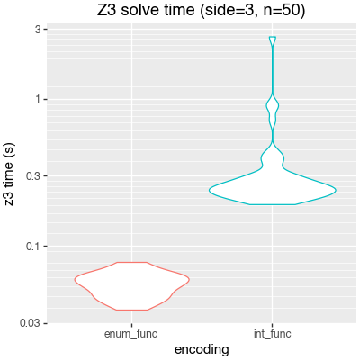

I've been meaning for a while now to spend more time getting to know [z3][z3] and [SMT solving][smt-lib] more generally. While out on part 2 of my pat leave, a friend happened to remind me of the existence of [regex crossword puzzles][regexle], and I got sniped. I've now implemented several different approaches to solving regex crosswords using z3. In this post I'm going to walk through a number of approaches and share some of what I learned.

- [ ] TK TK maybe show an example crossword?

## Regexes as DFAs

Thinking about this problem, my immediate thought was to rely on the fact that a regular expression describes a [regular language][regular-lang][^regular], and thus can be recognized using a deterministic finite automaton. Thus, I can encode a regular expression into a DFA, and then express regex matching in Z3 in terms of its transition function[^z3-re].


[^regular]: I include here the obligatory disclaimer that many modern "regular expression" libraries support non-regular features like backreferences. My strategy won't work for regex crosswords that use those, but I choose to be okay with that.
[^z3-re]: Some readers may be thinking "But wait! Doesn't Z3 natively support regular expressions??" When I started this project I wasn't aware of that feature, but see below!

That is, if we have a three-character string `S = [c0, c1, c2]`, and we have the transition table `T : State × Char → State` for our regex, we can express "the regex matches S" as something like:

```python
state_0 = init_state
state_1 = T(state_0, c0)
state_2 = T(state_1, c1)
state_3 = T(state_2, c2)
assert(state_3 in accept_states)
```

[regular-lang]: https://en.wikipedia.org/wiki/Regular_language

## Turning a regular expression into a DFA

With a bit of searching, I discovered [qntm]'s [`greenery`] library, which was pleasingly exactly what I was looking for -- a relatively straightforward Python library for manipulating regular expressions, including transforming back and forth between regex syntax and DFAs (which it calls [FSMs][greenery-fsm]). It will build an FSM for us, and in general it is pleasingly straightforward, optimized for simplicity, ease-of-use, and experimentation instead of raw performance, which is just fine for us -- we're going to make z3 do all the heavy lifting.

[qntm]: https://qntm.org/
[greenery]: https://github.com/qntm/greenery
[greenery-fsm]: https://github.com/qntm/greenery?tab=readme-ov-file#fsm

One complication is that `greenery` handles regular expressions over arbitrary Unicode characters; in order to avoid enormous lookup tables, it represents transitions in terms of character ranges, which I found slightly more annoying to work with. For this project, I'm willing to assume an alphabet of English letters (A-Z), so I wrote a helper to translate `greenery`'s structure into a flat `numpy` transition table:

```python
ALPHABET = string.ascii_uppercase

def flatten_fsm(fsm):
    nstate = len(fsm.states)
    nvocab = len(ALPHABET)

    assert fsm.states == set(range(nstate))
    state_map = np.full((nstate, nvocab), -1, dtype=np.int32)
    for st, map in fsm.map.items():
        for i, c in enumerate(ALPHABET):
            for cc, dst in map.items():
                if cc.accepts(c):
                    state_map[st, i] = dst
                    break
    return state_map
```

I also defined a small dataclass to bundle together various representations and analysis for a single regular expression:

```python
@dataclass
class Regex:
    pattern: str
    parsed: greenery.Pattern

    # 2d: (state, vocab) -> new state
    transition: np.ndarray
    # 1d: state -> bool
    accept: np.ndarray

    @classmethod
    def from_pattern(cls, pattern: str):
        parsed = greenery.parse(pattern)
        fsm = parsed.to_fsm().reduce()

        transition = flatten_fsm(fsm)
        nstate = transition.shape[0]
        accept = np.zeros((nstate,), bool)
        for st in fsm.finals:
            accept[st] = True

        return cls(
            pattern=pattern,
            parsed=parsed,
            transition=transition,
            accept=accept,
        )
```

## Mapping into Z3

In order to put the pieces together, we need to teach Z3 about the transition functions for each clue, define Z3 variables for each character in our grid, and then add appropriate constraints on the characters using the relevant transition functions.

I chose to represent both states and characters as integers (adding assertions to ensure that they were in-range), since that seemed simplest. Then, we need to encode the transition function relationship, between states and characters.

Z3 supports [function types][z3-functions], which can be declared and manipulated in expressions and assertions. Thus, I declared a function of the appropriate type, and informed Z3 of the transition table using an assertion for each entry in the transition table:

[z3-function]: https://microsoft.github.io/z3guide/docs/logic/Uninterpreted-functions-and-constants


```python
def build_func(solv: z3.Solver, clue: Clue):
    ctx = solv.ctx
    state_func = z3.Function(
        clue.name + "_trans",
        z3.IntSort(ctx),
        z3.IntSort(ctx),
        z3.IntSort(ctx),
    )
    pat = clue.pattern

    for (state, char), next_state in pat.all_transitions():
        solv.add(state_func(state, char) == next_state)

    s, c = z3.Ints("s c", ctx)
    solv.add(
        z3.ForAll(
            [s, c],
            (state_func(s, c) >= 0) & (state_func(s, c) < pat.nstate),
        )
    )
    return state_func
```

Given that definition, and given a string (represented as a list of characters), we can easily express the "regex matching" constraint:

```python
def assert_matches(solv: z3.Solver, clue: Clue, chars: list[z3.AstRef]):
    state_func = self.build_func(solv, clue)
    pat = clue.pattern

    # Create constants for each state
    states = z3.IntVector(clue.name + "_state", 1 + nchar, ctx=solv.ctx)

    # Express the transition requirement
    for i, ch in enumerate(chars):
        solv.add(state_func(states[i], ch) == states[i + 1])

    # Each state must be valid
    for st in states:
        solv.add(0 <= st)
        solv.add(st < pat.nstate)
    # State zero is the initial state
    solv.add(states[0] == 0)

    # The final state must be accepting
    solv.add(z3.Or([
        states[-1] == i
        for i, ok in enumerate(pat.accept) if ok
    ])
```

## Putting it together

With those primitives, we now just need to define a grid of characters, and add appropriate assertions. I was still using [regexle][regexle] as a source of test cases; it operates on a hexagonal grid, and mapping coordinates between the hex grid and the three different clue axes was honestly one of the hardest parts of this exercise! Glossing over that bit, though, the code is quite simple:

```python
def make_char(solv: z3.Solver, name: str) -> z3.ExprRef:
    ch = z3.Int(name, solv.ctx)
    solv.add(0 <= ch)
    solv.add(ch < len(ALPHABET))
    return ch

grid = [
    [make_char(solv, f"grid_{x}_{y}") for y in range(maxdim)]
    for x in range(maxdim)
]

for clue in all_clues:
    coords = word_coords(clue.axis, clue.index)
    chars = [grid[x][y] for x, y in coords]

    assert_matches(
        solv,
        clue,
        chars,
    )
```

# Optimization

At this point -- once I put all the pieces together -- I was able to solve crosswords (and cross-check a few hand / with [regexle]'s web interface), but it was ... painfully slow. Solving (certain) 3x3 puzzles took upwards of **ten minutes** of Z3 time on my M1 Macbook Air! Letting Z3 use multiple cores was worth a bit of a speedup, but fundamentally that seemed way too slow.

It seemed likely I'd done something wrong, but as a Z3 novice it was not immediately clear to me what to check, or what to try. I ended up trying a number of ideas, driven by vague hunches or intuition, but without any clear plan. I'm going to mostly share ideas that ended up working out, but I'll try to share a few notes on dead ends or false starts, too.

## Pruning states

My first idea was to give Z3 a hand by encoding some additional constraints which are easy to deduce from the structure of the regex and its FSM.

As a motivating example, consider the regex `(NR|Q|I)+`, from [today's regexle](https://regexle.com/?side=3&day=458) as I write this. It's immediately obvious, looking at that pattern, that the regex can only contain the letters N, R, Q, and I. Can we similarly detect that fact, and then encode it for Z3?

One option would be to walk the regex AST, and see which characters are explicitly named in the regex. However, I chose to do an analysis based on the `numpy` transition tables I had constructed, which I found pleasingly simple and robust.

We can define a state in our FSM as "dead" if there is no sequence of transitions leading from that state to any accepting state. We could detect dead states using a flood-fill along reversed edges from accept states, but we can get away with something simpler. `greenery` has a method which returns a [minimal FSM](https://github.com/qntm/greenery/blob/e55c96712677d56ef14664a1595a47fb7f26bc01/greenery/fsm.py#L166-L172), and a minimal FSM will only ever contain at-most a single dead state, since all dead states are behaviorally equivalent. Thus, in that dead state, all out-edges point back to the same state, and we can check for that condition using a cute bit of numpy:

```python
# Method on the above class `Regex`
@cached_property
def dead_states(self) -> set[int]:
    looped = self.transition == np.arange(self.nstate)[:, None]
    return set(np.flatnonzero(looped.all(-1) & ~self.accept))
```

(Per our above logic, `dead_states` will always be either empty or a singleton, but I found a `set[int]` slightly more convenient to work with than `int | None`)

Now, given the (zero or one) dead state, we can define a dead **character** as one which always transitions to a dead state, regardless of the starting state:

```python
@cached_property
def dead_vocab(self) -> set[int]:
    dead = set()
    for d in self.dead_states:
        dead |= set(np.flatnonzero((self.transition == d).all(0)))
    return dead
```

We can also ask which characters are dead starting from a given state:

```python
    def dead_from(self, state: int) -> set[int]:
        dead = set()
        for d in self.dead_states:
            dead |= set(np.flatnonzero((self.transition == d)[state]))
        return dead
```

Armed with that information, we can give Z3 a few more constraints:

```python
for d in pat.dead_vocab:
    for ch in chars:
        solv.add(ch != d)

for d in pat.dead_from(0):
    solv.add(chars[0] != d)

for d in pat.dead_states:
    for st in states:
        solv.add(st != d)
```

These constraints are, of course, strictly-speaking redundant, but hopefully they will let Z3 focus faster on the "interesting" part of the search space.

And indeed, adding these heuristics helped **immensely** -- most side-3 puzzles solved in under a second, and the slowest ones were less than 10 seconds. We're now at least beating "solve the puzzle by hand!"

As a brief aside, I found this pruning exercise an interesting example of how you can use a generic prover/solver like Z3, but nonetheless augment it with domain-specific heuristics to improve performance. Of course, if I wanted, it would also be a relatively straightforward exercise to ask Z3 to **verify** that my extra constraints are redundant on a few specific problems, which would be a nice consistency check I didn't bother to undertake.

## Using z3 enumeration sorts

[regexle.com](https://regexle.com), though, supports puzzles up side-length 32! If we want to go past side-3, we're going to need to do a lot better.

Z3 is [an SMT solver][smt]. What that means, specifically, is that it's a SAT solver augmented with support for various datatypes and rules and and logic on those types, including (e.g.) the rules of integer arithmetic.

We've been using integers to name states and characters, since that's easy and since that's where most Z3 tutorials start. However, our FSM states and our characters don't actually have any meaningful arithmetic structure; any effort Z3 expends searching for or trying to use rules about addition, or range arithmetic, or other solvers or heuristics, is just wasted. Can we find a way to tell Z3 that (e.g.) our FSM states are just N different distinct objects with no structure **other** than what we describe?

I suspect this is a case where asking a Z3 expert would have saved me a ton of time, but I instead spent a long time reading Z3 and SMT-LIB documentation, as well as various Stack Overflow questions and answers, to arrive at what I believe is the correct answer: Z3 enumeration types. We can define our FSM states and our alphabet as Z3 enumeration types, which means essentially what I just said: This type has exactly N distinct values, but no other assumed structure.

```python
nstates = max(c.pattern.nstate for c in all_clues)
state_sort, states = z3.EnumSort(
    "State",
    [f"S{i}" for i in range(nstates)],
)

char_sort, alphabet = z3.EnumSort("Char", list(ALPHABET))
```

The rest of our code is only minimally changed; we need to replace `IntSort` in the declaration of our transition functions, and we need to replace `i` with `states[i]` or `alphabet[i]` any time we are expressing a comparison in the Z3 AST.

This small change produced a **drastic** improvement, both to the mean solve time, but **especially** at the tails:


{.center}

### A false start: `FiniteDomainSort`

While exploring options for representations, I stumbled upon [z3.FiniteDomainSort][finite-domain] in the z3py documentation. A "sort" is the Z3 name for what I'd think of a "type" in other contexts, and so a "finite-domain sort" ought to be a fresh datatype which has exactly `size` distinguished elements -- exactly what I needed. I coded up an implementation ... and my solver promptly started emitting total garbage: completely, obviously, invalid solutions. After a bit of searching, I found [a bug report][finite-domain-bug] and some other mentions that it is a special-case object only intended for the z3 Datalog engine, and just silently misbehaves in other contexts. Welp.

[finite-domain]: https://z3prover.github.io/api/html/class_microsoft_1_1_z3_1_1_finite_domain_sort.html
[finite-domain-bug]: https://github.com/Z3Prover/z3/issues/4842

## Defining the transition function explicitly

Using `EnumSort` made the solver reasonably fast -- it solves side-length-8 puzzles in 10 seconds or so -- and I almost left the problem there. However, my intuition insisted that we could still go even faster, and so I continued reading Z3 documentation and API reference, and pondering alternate encodings or approaches. In particular, my encoding of the transition table was bugging me: We know the complete table explicitly, and so encoding it as an uninterpreted function object and then constraining it using a bunch of assertions about each input-output point felt unnecessarily roundabout.

I eventually realized that there was no need to encode it as a Z3 function at all! At some cost to the size of our expression, we can express the relationship between each adjacent pair of states as an explicit Z3 expression, using a chain of Z3 if-then-else expressions. We begin with a helper function to test a variable against a list of possibilities:

```python
def build_match(
    var: z3.AstRef,
    test: list[z3.AstRef],
    result: list[z3.AstRef],
) -> z3.AstRef:
    """Return a Z3 `if` ladder comparing var against each `test` value.

    If `var == test[i]`, the ladder evaluates to `result[i]`. If no
    `test` matches, evaluate to `result[-1]`; it is anticipated that
    the list of tests will be exhaustive in most cases.
    """
    expr = result[-1]
    for test_, then_ in zip(test[:-1], result[:-1], strict=True):
        expr = z3.If(var == test_, then_, expr)
    return expr
```

Now, given Z3 variables corresponding to a state and a character, we can build an explicit expression defining the new state:

```python
def build_next_state(
    self, clue: Clue, st: z3.AstRef, ch: z3.AstRef
) -> z3.AstRef:
    pat = clue.pattern
    by_state = [
        build_match(
            ch,
            self.alphabet,
            [self.states[out] for out in pat.transition[i]],
        )
        for i in range(pat.nstate)
    ]

    return build_match(
        st,
        self.states[: pat.nstate],
        by_state,
    )
```

Now, where previously we had written `state_func(states[i], ch) == states[i + 1]`, we can instead embed the entire expression for each transition:

```python
for i, ch in enumerate(chars):
    solv.add(self.build_next_state(clue, states[i], ch) == states[i + 1])
```

Indeed, this approach turned out to massively speed up the time that Z3 spent solving puzzles. Unfortunately, it does so at the expense of spending much more time in Python encoding the puzzle into a Z3 AST, due to evaluating `build_next_state()` once per character per clue, instead of just once per clue:


It really feels like we ought to be able to get the both of both worlds, somehow.

### So many ways to describe a function

## Using Z3's `RegEx` theory


<!-- However, while skimming the [SMT-LIB language standard][smt-lib-spec], I happened to notice the `define-fun` command, which allows the definition of a named function **with an explicit implementation**. For instance, the following script prints `8` when evaluated with z3 (or another compatible solver):

```scheme
(define-fun double ((x Int)) Int (* x 2))
(simplify (double 4))
```

I could find a way to access `define-fun` using the Z3 Python bindings, but that discovery was enough to set me on a search to find an alternate way to encode the FSM transition tables into Z3, figuring that perhaps an explicit encoding would help Z3 evaluate and search faster.

I ended up trying a **lot** of variations. I'll walk through some of the
-->


[smt-lib-spec]: https://smt-lib.org/papers/smt-lib-reference-v2.7-r2025-07-07.pdf


## Outline
- Regex as DFA
- Getting a DFA
  - Greenery
  - Flattening
- First try: integers, implicitly-defined function
- Optimization: pruning
- Optimization: EnumSort
  - Dead end: FiniteDomainSort
- Optimization: Define function explicitly
- Alternate approach: z3 Regexes

## TODO
- [ ] Link to code
- [ ] (maybe?) file and link to issue
- [ ] stylize as "Z3" consistently

[z3]: https://microsoft.github.io/z3guide/
[smt]: https://en.wikipedia.org/wiki/Satisfiability_modulo_theories
[smt-lib]: https://smt-lib.org/
[regexle]: https://regexle.com/
