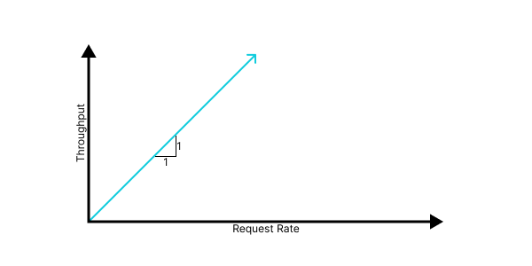
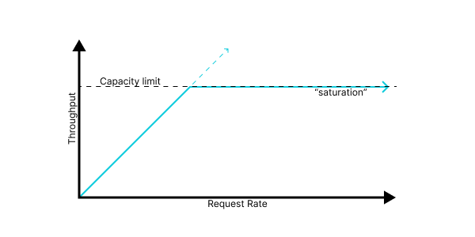
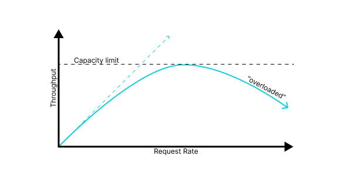
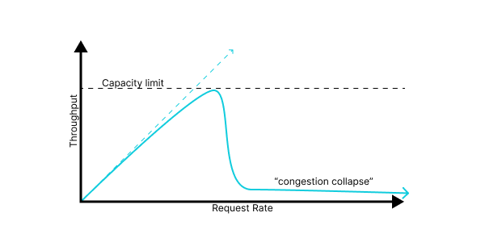
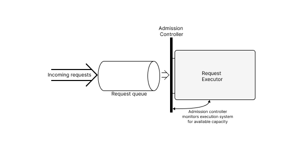
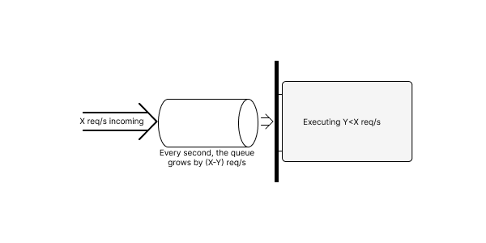

Suppose we’ve got a service. We’ll gloss over the details for now, but let's stipulate that it accepts requests from the outside world, and takes some action in response. Maybe those requests are HTTP requests, or RPCs, or just incoming packets to be routed at the network layer. We can get more specific later.

What can we say about its performance?

All we know is that it receives requests, and that it acts on them. This already gives us two useful metrics to talk about:

- We can talk about **request rate**, the volume over time of incoming requests. We’ll often measure this in “requests per second,” but in some cases the total volume of data is more important than individual requests, so we’ll instead (or additionally) talk about “bytes per second.”
- Some (in the best case, all) of those requests will be successfully processed. We can also talk about this rate — successful work accomplished per unit time — and we’ll call this **throughput**.

Now is probably a good time to introduce some concrete examples, which we’ll return to throughout our discussion. I’ve picked two system sketches based on systems I’m familiar with, but they’re fairly common archetypes you'll likely recognize.

{}
{}
Our first example will be an **HTTP web application**. For concreteness,  we’ll consider a web service built using a specific, relatively common, architecture: We’ll have an `nginx` web server acting as a reverse proxy in front of a pool of Python worker processes, each of which contains the application code and makes use of a backend database.

For such a service, we’ll measure “request rate” as the rate of incoming HTTP requests arriving at `nginx`, and the “throughput” will be something like “the rate of successful requests,” where success means something like “received an HTTP 200 response.”
{}

{}
Our second case study will be a **TCP/IP router or firewall**. This service sits in between two (or more) networks, receives incoming packets on any of its interfaces, determines whether and where to forward them, and sends them out a different interface.

For this system, we care about “request rate” measured both in packets received per second and in bytes per second: we may have different characteristics in the “many small packets” or “fewer large packets” regimes. Our throughput, here, is packets (or bytes) successfully forwarded per second.
{}
{}


With these two metrics established, we can talk about performance in the abstract as a relationship between them: throughput as a function of request rate. That is to say, as we receive more traffic, how does it impact the amount of useful work we perform?

In a perfect world of pure thought, every request is always processed successfully and we would achieve a 1:1 relationship between request rate and throughput.


{{}}


However, in our fallen world, we run systems on finite quantities of physical hardware, and so they have some finite **capacity**: a maximum throughput achievable given the system design and the available hardware. A more realistic goal, then, is for a linear relationship until that capacity limit, followed by **saturation**, a regime in which additional requests fail, but also do not hurt our throughput.


{{}}


It’s worth remembering that **every system** has some limit. Sometimes you may be fortunate and that limit is large enough to usefully approximate as “infinity,” but it’s always there. A system without documented capacity limits still has them, it just **isn’t telling you what they are**.

Reality, however, is even crueler still. Without careful design and tuning, most systems behave much worse than the above plot; once they’re at capacity, additional requests **overload** the system in some way, consuming valuable resources without resulting in useful throughput, and so we get behavior that looks like:


{{}}

Or, even worse:

{{}}

We have a few terms to describe a system is in this mode, where it’s receiving a high request rate but achieving throughput much lower than its capacity. Which ones we use often depends on the details of the failure mode, but I’ve taken to using the term [**congestion collapse**](https://en.wikipedia.org/wiki/Network_congestion#Congestive_collapse) as a broad descriptor for this regime. I’m not sure if that term is widely used outside of the specific context of networking, but I find it’s usually readily understood.

Solving congestion collapse in any concrete system depends a lot on the details and the specific problems, but there are a number of general patterns that recur often.


# Contention and admission control

The most common reason that a system behaves poorly under heavy load is **contention** for some shared resource. In this context, I take that to mean any situation where multiple processes are trying to make use of some resource, and the overhead from their interactions means that adding additional concurrency decreases the **total effective throughput** for that resource. When a system is losing performance due to this sort of contention, we often describe it as [**thrashing**](https://en.wikipedia.org/wiki/Thrashing_(computer_science)).

Many resources suffer from contention, but here are some common examples:

- If we have many more processes running than we have physical CPUs, we will incur many more context switches and more scheduler overhead, and our throughput will decrease.
- If we have a cache (for instance, database’s in-memory disk cache), that is large enough to cache the relevant data for `k` concurrent requests, we’ll see performance drop off rapidly as we try to run more than `k` concurrent requests, since our cache will thrash between different requests' data and our hit rate will plummet.
- Many [optimistic concurrency systems](https://en.wikipedia.org/wiki/Optimistic_concurrency_control) — including many lock-free algorithms — degrade badly under heavy load, in the worst case entering a mode where no client can make any progress, due to conflicting transactions. We refer to this worst-case failure, where each client is doing a lot of a work but no client is making progress, as [**livelock**](https://en.wikipedia.org/wiki/Deadlock#Livelock).

{}
{}
In the case of our nginx→python→database architecture, there are a number of points commonly subject to problematic contention.

- If our worker processes consume too much memory, our server will come under memory pressure and lose performance due to [paging or swapping](https://en.wikipedia.org/wiki/Memory_paging).
- Similarly, if we run many more processes than our server has CPUs, we may run into excess context switching and cache pressure.
- In a threaded Python service, [GIL contention](https://wiki.python.org/moin/GlobalInterpreterLock) can reduce throughput past some point.
- Databases can very often suffer from congestion collapse, and so even if the application server is healthy, too many concurrent requests may drive down database throughput.

{}
{}
The term “congestion collapse” was, to my knowledge, [originally coined in the context of networking](https://en.wikipedia.org/wiki/Network_congestion#Congestive_collapse), so it’s unsurprising that a network router can be prone to this failure. A few specific mechanisms:

- If multiple senders use a shared physical medium, such as RF bandwidth for WiFi or [classic ethernet](https://en.wikipedia.org/wiki/Ethernet#Shared_medium), multiple nodes attempting to “talk over each other” can result in loss of usable communication time, eating into available bandwidth.
- If the network is forced to drop packets due to retries, poorly-configured retry behavior by clients can result in an **increase** in the total amount of attempted traffic, resulting in a runaway feedback loop.
- If a software router  receives interrupts to learn about incoming packets, it's possible to enter a state of [interrupt livelock](https://cs.nyu.edu/~mwalfish/classes/ut/f09-cs395t/ref/mogul96usenix.pdf), where all available CPU time is spent processing incoming-packet notifications, and no actual routing work can be accomplished.

{}
{}

The basic strategy to resolve contention is to deliberately limit concurrency to levels which don't cause undue contention. In broad strokes, we can implement this
by adding a request queue which holds incoming requests, and an **admission controller** which only allows requests to leave the queue and begin processing once there is available capacity. The term “**admission control**”[^admission] in roughly this sense is used in some database and communications systems, but I tend to generalize it for any technique fitting this broad pattern.

{{}}

[^admission]: [Wikipedia has many citations](https://en.wikipedia.org/wiki/Admission_control) for this term in networking and interconnects; I first encountered it in the database context but can’t find as good a citation; you can see [this paper, page 14](https://courses.cs.washington.edu/courses/cse444/20sp/papers/AnatomyDB.pdf) for one example of this usage, though.

Admission control policies vary; at the simplest, we can compute a single, static, value for the maximum concurrency and use a [semaphore](https://en.wikipedia.org/wiki/Semaphore_(programming)) to limit in-flight requests; at the other extreme, we can have a sophisticated gating agent with a model both of the bottleneck resources in our system, and of the resources required by each incoming request.

{}
{}
For a Python HTTP service, perhaps the simplest form of admission control is using a configuration that only runs exactly N worker processes per host. If N is chosen carefully, such a limit can mostly solve CPU and memory thrashing.

In more sophisticated designs, each node may be able to communicate its health to a load-balancer; if this determination is based on available local resources, we might view this as a form of admission control.

In either case, we tend not to think of an explicit queue in front of the application service, but the load-balancer will often [maintain an internal queue](https://nginx.org/en/docs/http/ngx_http_upstream_module.html#queue), and the network listen queues and socket buffers will additionally serve as implicit queues for pending requests.
{}
{}
In networking systems, we most commonly think of admission control as guarding the physical layer of the network. The transport medium, be it air, copper, or fiber-optic cable, has some maximum capacity, and the hardware is responsible for only transmitting packets at a rate it can absorb. To absorb bursts above this capacity, the NIC and the software on the router will both maintain packet queues which will be drained onto the network as capacity becomes available.
{}
{}

The phenomenon of contention has at least one important implication: If your system is at capacity on some critical resource, increasing concurrency is likely to **hurt throughput rather than help**. In the worst case, if we add capacity to a non-bottleneck resource, it may **reduce** performance, if doing so increases contention on the limited resource. Concretely, if our application is bottlenecked on the database, increasing the number of concurrent processes may drive the database further into the ground and reduce overall throughput, instead of improving the situation.

# Queues are either empty or full

With appropriate admission control, we can limit contention and keep internal throughput high at any request rate. However, our problems don’t end there. If the rate of incoming requests is persistently higher than our maximum throughput, these requests will, by default, accumulate in the request queue without bound.

{{}}

We'll make a few observations about this state of affairs:

- The throughput here is independent of the size of the queue. If the queue is short or long (as long as it's never empty), we're pulling mesages off at the same rate, and processing messages at the same rate. This fact is important: **queues cannot increase peak capacity**.
- As the queue grows, so does overall latency; with N messages in the queue, it will take N/Y seconds to process them, and thus also N/Y seconds for a request to make it from the left side of the queue to the right, assuming FIFO behavior.
- As the queue grows, eventually, one or more of the following will happen:
  - The queue will hit a configured maximum queue size, and will be forced to drop messages.
  - The queue will not have a configured maximum size, but will exhaust available storage space (typically, disk or memory) on the server.
  - As latency rises, eventually the clients upstream of our service will time out, and begin treating requests as failed, even if they might eventually succeed
internally to our system.

In many systems, the first symptom -- a configured queue size limit causing dropped requests -- will be the first place we actually observe an error during overload. When this happens, it's tempting to fix the immediate problem by increasing the queue size; but insofar as our problem is a genuine capacity problem -- aggregate throughput is less than the request rate -- doing so will not restore health: **queues cannot increase peak capacity**.

If, instead, we encounter the third issue -- timeouts due to high latency -- we may make the observation that any request which has been in our system past the relevant timeout has “already failed” and it’s not worth spending further time on it. We can then add an explicit check inside the request queue, or when we dequeue requests, in order to not spend any more work on those requests. We might write logic like:


```python
next_request = queue.pop()
if time.time() - request.arrival_time >= REQUEST_LATENCY_BUDGET:
  return_error(request, RequestTimedOut()
else:
  process(request)
```

Such a check, can, if done properly, improve our situation somewhat: it will increase the queue dequeue rate to match the queue enqueue rate, on average, and the queue will stop growing.

However, such a check also can't shrink the queue past some point: once the queue is a size that takes `REQUEST_LATENCY_BUDGET` for requests to pass through, we will stop draining it. If the request rate remains high, then, we'll hover precisely around that size, incurring an added latency hit to every request we process. In the best case, we will achieve good throughput, but with `REQUEST_LATENCY_BUDGET` of extra latency; in the worst case, we haven't built in enough headroom, and requests time out anyways.

We say that such a system has a **standing queue**. In healthy systems, queues are used to absorb temporary spikes but drain quickly; here we have a sizeable queue which persists in a steady state, leading to undesired latency.

{}
{}

In our prototypical HTTP web-service architecture, under heavy load, it's very common that first component to "notice", in the sense of signaling or logging an error, will be our `nginx` frontend, which has carefully managed limits on [how many concurrent in-flight requests][worker_connections] it will permit.

[worker_connections]: https://nginx.org/en/docs/ngx_core_module.html#worker_connections

As described, though, merely increasing this number is rarely actually a solution, but may just push the problem elsewhere. In general, if I see ["worker_connections are not enough"](https://stackoverflow.com/questions/28265717/worker-connections-are-not-enough) in my `nginx` logs, my first guess is always a capacity bottleneck behind the nginx, not that I should actually increase that setting.

Request queues inside of of `nginx` and in various network buffers can be very implicit and hard to directly observer as an operator. One solution I like is to have nginx [add a header to the request](https://nginx.org/en/docs/http/ngx_http_proxy_module.html#proxy_set_header) containing the [current timestamp](https://nginx.org/en/docs/http/ngx_http_core_module.html#var_time_iso8601); once the request reaches application code, we can subtract the now-current time from the time as recorded by nginx, and get a measure of queue latency.
{}
{}

In the networking context, this problem of standing queues is exactly the infamous “[bufferbloat](https://en.wikipedia.org/wiki/Bufferbloat)” problem. In an attempt to avoid dropping packets and with memory costs dropping faster than network throughput, networking hardware has added ever-growing packet queues to store incoming packets and then forward them at the network’s capacity. However, if the network is persistently oversubscribed, these queues can’t actually make the physical wires any faster or thicker, and absent careful management they quickly become standing queues that add latency for any packet which is forced to wait in them!
{}
{}

The two takeaways from this section are some of the most important I hope to leave you with:

- Queues can help smear out bursty load in time, but **cannot increase peak throughput** in aggregate.
- If, under load, we accumulate persistent standing queues, our queues are adding latency for no benefit; potentially disastrous amount of latency.

# What does work

Ultimately, if we are persistently over capacity, and we're unable or unwilling to add capacity, there's only one solution: Somehow have less work to do.

I tend to think about two related strategies towards this goal:
- We can somehow ask our clients to make fewer requests, and thus reduce the incoming request load.
- We can choose not to process a subset of requests, discarding them as cheaply as possible and freeing up resources to process remaining requests successfully.

We refer to either or both of these strategies as [**backpressure**](https://medium.com/@jayphelps/backpressure-explained-the-flow-of-data-through-software-2350b3e77ce7); in either case, we are in some sense “pushing back” on the incoming work, and making our clients aware of our capacity limit. In the first case we’re explicitly asking them to slow down; in the second, we are causing them to receive errors or dropped requests, which they have to handle somehow.

As a service designer and maintainer who cares about your availability and your users’ experience, it can be counterintuitive to push problems back onto your users in this way; it can feel like admitting failure, or shirking responsibility. No one likes to deliberately discard a valid request. However, resilient systems inevitably require some form of backpressure, for a few reasons:

- As mentioned, every system has **some** limits; when we do encounter them, we would prefer to make intentional decisions about what happens and to behave deliberately and to behave as gracefully as possible.
- More importantly, backpressure creates a [closed-loop system](https://en.wikipedia.org/wiki/Control_loop#Open-loop_and_closed-loop).  If a normally-healthy system is overloaded, the proximate reason for that overload is that someone is sending us too much traffic. By pushing the problem back to them, we move the problem and the source of the problem closer together, allowing for the possibility of actual resolution.

## Flow Control

If we are able to co-design our system along with the client protocol and/or the clients interacting with it, we can sometimes build in back pressure in the form of a [**flow control**](https://en.wikipedia.org/wiki/Flow_control_(data)) mechanism, where a receiver directly signals a sender what constitutes a safe or supported rate of traffic.

Most low-level communication primitives (e.g. TCP sockets or UNIX pipes) implement some form of flow control by limiting the amount of sent-but-unprocessed data in a stream. Thus, if our protocol performs communication primarily over a single or a small number of such streams, we can sometimes “inherit” a basic form of flow control from the underlying substrate.

{}
{}
Explicit flow control mechanism are less common in HTTP web services, but I can think of a few mechanisms which might qualify, at least in spirit:

- The [“429 Too Many Requests” HTTP Status Code](https://developer.mozilla.org/en-US/docs/Web/HTTP/Status/429), standardized [around 2012](https://www.rfc-editor.org/rfc/rfc6585#section-4), allows for a server to explicitly signal that a request is being rejected due to load or rate limiting, and allows a `Retry-After` header to tell the client how long to pause before retrying.
- Some HTTP APIs provide headers in every response communicating [rate limit status and how close a requester is to being limited](https://docs.github.com/en/rest/overview/resources-in-the-rest-api?apiVersion=2022-11-28#rate-limit-headers).

{}
{}
We often think of the main goal of the TCP protocol as ensuring reliable, in-order delivery, but its flow control behavior is also critical to the functioning of all modern networks.

TCP has to solve two related flow control problems: It has to prevent a fast sender from overloading slower receiving process, and it also has to prevent senders **collectively** from overloading any network link. To manage these needs, TCP uses the notion of a “[window size](https://en.wikipedia.org/wiki/TCP_tuning#Window_size)” to track how much data a sender is allowed to send at a time. A TCP sender tracks two window sizes to estimate the available capacity separately for the receiver of a flow, and for the network link itself.

TCP uses an [explicit flow control](https://en.wikipedia.org/wiki/Transmission_Control_Protocol#Flow_control) mechanism for the receive window: Each TCP packet contains the current value of the receive window, allowing receivers to continually signal how much data they are prepared to accept.
{}
{}

## Load shedding

If we don’t have access to a flow control mechanism, or if clients are not respecting it, then our remaining option is **load shedding**: we select some subset of requests, and *discard them as early as possible* (this can either mean literally forgetting about them, or returning an error, if doing so is sufficiently cheap). By doing so, we free up resources and drain our queue(s), allowing the remaining requests to be processed successfully.

Load shedding is related to **rate limiting**, where we limit the number of inbound requests for each user, and return errors if the user is above some limit. In general, the distinction I see is that “rate limiting” indicates per-user limits that are always in effect and enforced regardless of overall system capacity, and “load shedding” specifically denotes mechanisms that kick in once the system at a whole is at or near some capacity limit. In practice, in many contexts one common reason for being over capacity is some single runaway user, and so they end up being closely related and often solve overlapping problems.

There are many strategies we can adopt to pick which requests to drop to shed load; some common ones include:

- **Random drop**
    - This is simple and cheap to implement: it can potentially be done with no parsing at all of the incoming request, and no coordination between multiple frontend components. Depending on context, it can also be perceived as “fair”
- **Client tiering**
    - If you have a free tier and a paid tier, you can preferentially drop free requests. This can be generalized in any number of ways, up to and including a out spot market where requests contain bids for capacity. Tiering can work particularly well in a system with explicit [SLA](https://en.wikipedia.org/wiki/Service-level_agreement)s where some users are contractually guaranteed a certain level of service, but others are not.
- **Request tiering**
    - You can instead prioritize based on the **type** of request, preferring to drop requests that are less likely to be time-sensitive or easier to retry later. At Stripe, for instance, requests to charge customers were considered much more critical than simply retrieving or listing older payments; if the API service was under excessive load, we would prioritize the former and deliberately drop [some of] the latter.
- **Fair allocation**
    - Uniform random dropping is fair in the sense that every request has an equal chance of getting dropped. But it also creates an incentive to spam requests: if one user constitutes 80% of all incoming requests, they will receive 80% of the throughput. Thus, sometimes it makes sense to allocate capacity according to some more-nuanced definition of “fairness” — e.g. allocate available capacity evenly on a per-client basis instead of per-request.
    - In practice, this sometimes requires additional coordination and can be challenging to implement, and it often suffices to implement per-user rate limiting that fires before the load-shedder, which accomplishes a similar goal.

{}
{}
We see a wide variety of load shedding and rate limiting techniques in HTTP web services.

One common pattern for a “Python plus a database” application is that requests may be relatively heavyweight to handle, in terms of running a relatively large amount of application code or making many or expensive database queries; this expense often pushes towards a multipart system of load shedding:

- We’ll often incorporate a high-performance rate limiter in front of our service, perhaps using [nginx](https://www.nginx.com/blog/rate-limiting-nginx/) or a [CDN](https://developer.fastly.com/learning/concepts/rate-limiting/) or a [cloud service](https://docs.aws.amazon.com/waf/latest/developerguide/waf-rule-statement-type-rate-based.html) to reject the very highest bursts of traffic (potentially up to and including explicit DDoS attacks) before they ever reach the heavyweight application code.
- Then, once traffic does reach our application, we can additionally implement more-nuanced limits, using our application’s authentication and/or routing logic to classify requests. If we can do this without hitting our database this can still be much cheaper than processing the request.
- Alternately, we may use an “[API Gateway](https://aws.amazon.com/api-gateway/)” in front of our application, which implements some combination of routing, authentication and request-aware rate limiting entirely outside of our application code.

My former coworker [Paul Tarjan](https://paultarjan.com/) did [a great writeup at Stripe](https://stripe.com/blog/rate-limiters) describing the rate limiting and load shedding decisions and techniques implemented at Stripe, which used a very similar frontend/application code/database architecture.
{}
{}
A TCP receiver knows its own capacity and can “just tell” the sender to slow down, but managing and estimating network capacity is harder, since it involves interactions between all the different flows and nodes that are sharing a link.

Classically, TCP relies on detecting dropped packets in order to detect congestion. It is assumed that dropped packets mean the network link is overloaded, and that the sender needs to slow down. This design essentially takes a load shedding mechanism (the network dropping packets), and repurposes it as a form of flow control.

Historically, network equipment used the simple [“tail drop”](https://en.wikipedia.org/wiki/Tail_drop) algorithm to drop packets under load. This choice works great to manage load on the router itself, but it turns out to have very poor emergent properties for the TCP flow control behavior of the network as a whole. Thus, modern routers implement “[active queue management](https://en.wikipedia.org/wiki/Active_queue_management)”, making strategic decisions about which packets to drop and thus, which flows are signaled to slow down. The modern [CoDel](https://en.wikipedia.org/wiki/CoDel) algorithm has done wonders to alleviate, if not to completely solve, the bufferbloat problem.

Additionally, the TCP [Explicit Congestion Notification](https://en.wikipedia.org/wiki/Explicit_Congestion_Notification) extension allows routers to set a flag indicating that congestion is occurring, without having to drop data. If all actors on a network flow support ECN, a router doing active queue management has the option to set a “congestion occurred” flag to signal a stream to slow down, without actually dropping a packet.

Active queue management requires that the router has enough spare capacity to be making deliberate decisions about packets. If, instead, the rate of incoming packets is high enough to risk overloading the router’s own processing power, we may need to additionally [drop packets even earlier in the router’s pipeline](https://cs.nyu.edu/~mwalfish/classes/ut/f09-cs395t/ref/mogul96usenix.pdf), perhaps even at the level of the NIC hardware.
{}
{}


## Adding Capacity

My aim for this post is primarily to explore techniques and frameworks for understanding and managing systems that are **overloaded**, which is to say, persistently at or above some capacity limit. In practice, if a system is routinely overloaded, we’ll often want to resolve the problem by adding capacity, instead of (or in addition to) taking interventions to make the overloadeed condition more graceful. Before I leave, I do want to say a few notes about increasing system capacity.

First, “adding capacity” and “handling overload gracefully” is often not an “either/or” decision; real systems tend to benefit from some amount of both. For instance, we might implement autoscaling to add capacity, but use a load-shedder to make sure that we still behave gracefully while we wait for that capacity to come online. Or we might provision capacity to handle “legitimate” load, but still need backpressure or load shedding techniques to handle buggy or poorly-designed processes that occasionally send us 10x our baseline load.

Second, I want to emphasize that when we add capacity, it’s important to identify the **bottleneck resource(s)** and scale them up. If we scale up the wrong resource (e.g. adding more application CPUs to a service that’s bottlenecked on a database), we will sometimes instead make the problem worse! And the reasons this happen are intimately related to the topics discussed here around contention and standing queues: systems are fractally composed of smaller systems, and individual subsystems may be prone to these failure modes in different and subtle ways. Thus, even if our goal is to add capacity until we are always overprovisioned, it often behooves us to understand these lessons for how systems behave when over capacity.

# Conclusion

"How does a system behave at or beyond its capacity?" is a question that is often glossed over in introductory software engineering resources and in initial systems designs, but in my experience it's one that practically defines the experience of working on complex systems at scale.

For any particular system, the details of the system and the capacity limits matter a lot; But I've also found there's a lot of common trends and themes, and a lot of high-level similarities if you're able to consider these details at a few levels of abstraction up. And if you really have those patterns internalized and can recognize them, they can be an invaluable guide to identifying which details matter and putting them in context.

This post is attempt to summarize the landscape of themes and concepts that exists in my head around this question, and articulate some of those patterns and trends in a shareable way. My hope is that it will help engineers who are encountering some of these problems for the first few times in a new application put them in context, and find pointers to prior art or concepts that may be valuable. Let me know if it lands for you.
